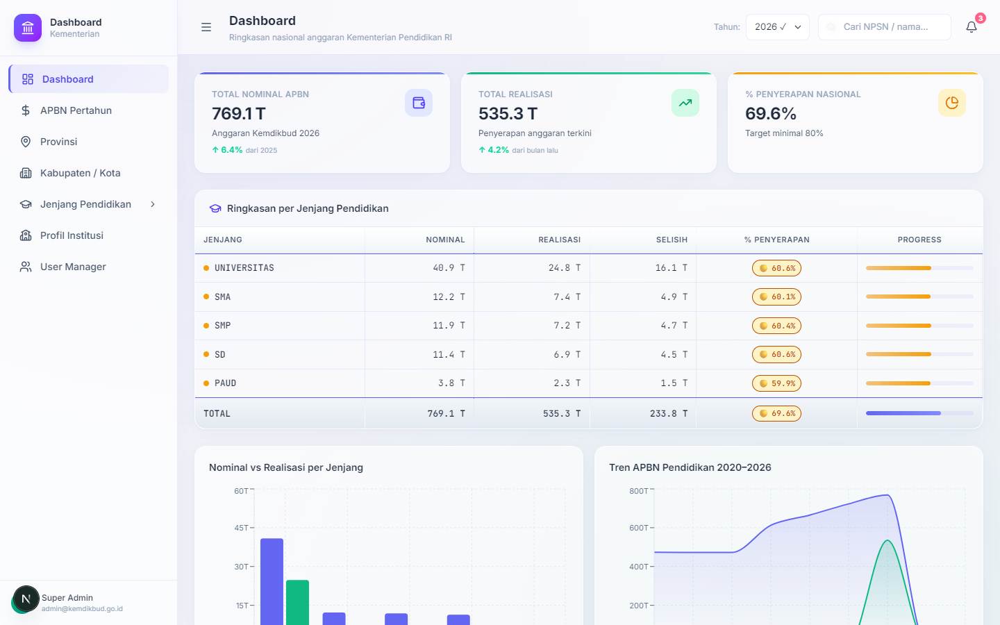
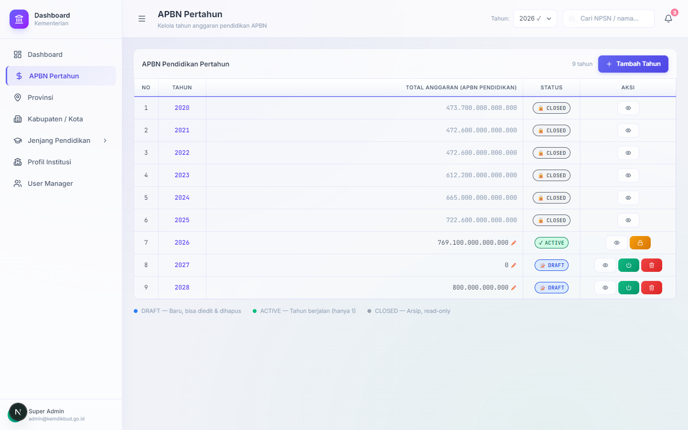
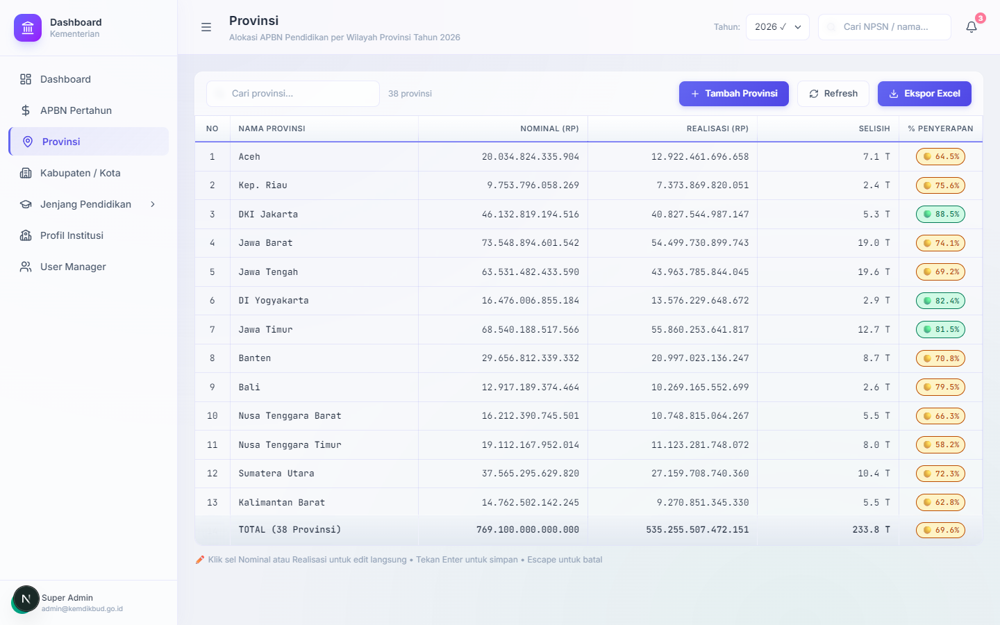
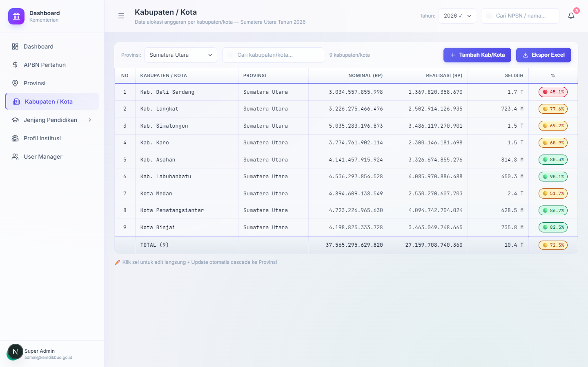
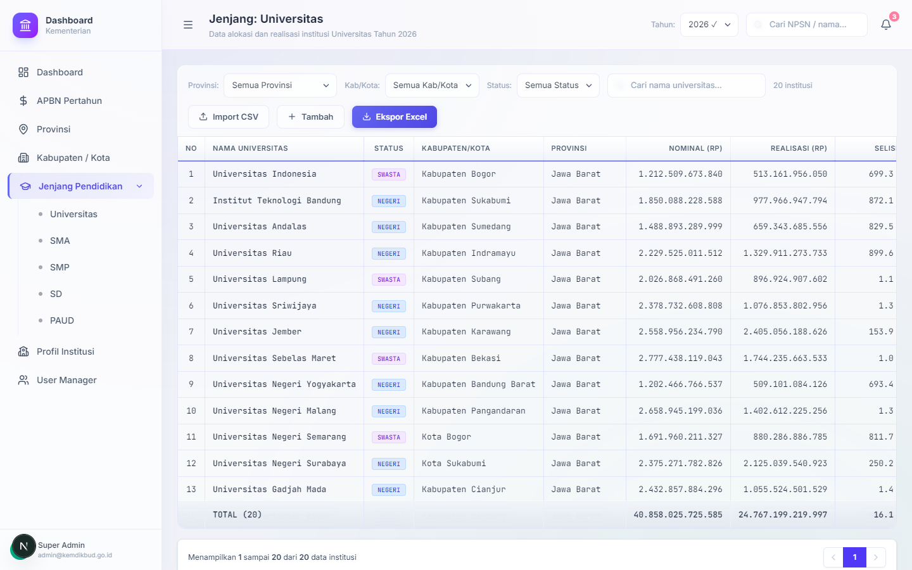
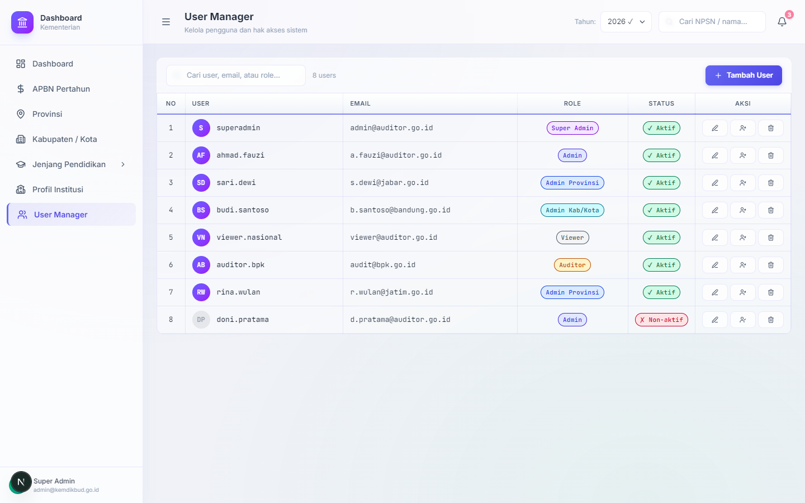

# Dashboard Kementerian 🇮🇩

Sistem informasi modern bergaya _spreadsheet_ untuk pemantauan, alokasi, dan transparansi Anggaran Pendapatan dan Belanja Negara (APBN) di sektor Pendidikan Indonesia.

Aplikasi ini menyajikan *dashboard* dengan performa tinggi yang memungkinkan instansi terkait (mulai dari level nasional hingga institusi pendidikan seperti sekolah dan universitas) memantau alokasi vs realisasi anggaran secara berjenjang dan real-time.

---

## ⚡ Quick Deploy to Vercel

Dapatkan aplikasi ini online dalam satu klik menggunakan tombol di bawah ini:

[](https://vercel.com/new/clone?repository-url=https%3A%2F%2Fgithub.com%2Fadimaryanto-stack%2FDashboard-Kementerian)

---

## ✨ Fitur Utama

- **Navigasi Berjenjang (Hierarki)**: Pemantauan dana mulai dari **APBN Nasional -> Provinsi -> Kabupaten/Kota -> Jenjang Pendidikan** (Universitas, SMA, SMP, SD, PAUD).
- **Antarmuka Bergaya Spreadsheet**: 
  - Input data nominal dan realisasi secara langsung *(inline editing)*.
  - Perhitungan **Selisih** dan **Persentase Penyerapan** otomatis (kaskade) dari bawah ke atas.
- **Visualisasi Data**: *Dashboard* analitik dengan metrik utama dan grafik tren tahunan menggunakan *Recharts*.
- **Desain Modern (Glassmorphism)**: UI/UX premium dengan *Light Mode*, efek *frosted glass* (transparan-blur), serta aksen warna yang halus.
- **Manajemen Pengguna (RBAC)**: Role-Based Access Control (Super Admin, Admin Provinsi, Auditor, Viewer, dll.) dengan kontrol status aktif/non-aktif.

---

## 🛠️ Stack Teknologi

Sistem ini dibangun menggunakan ekosistem *web modern* dengan performa tinggi:

- **Framework**: [Next.js 16 (App Router)](https://nextjs.org/) & React 19
- **Bahasa**: TypeScript (Strict Typing)
- **Styling**: [Tailwind CSS v4](https://tailwindcss.com/) dengan arsitektur variabel berbasis `@theme`.
- **State Management**: [Zustand](https://github.com/pmndrs/zustand)
- **Ikon & Grafik**: Lucide React & Recharts
- **Export Excel**: ExcelJS + file-saver

---

## 📂 Struktur Proyek

```text
dashboard-kementerian/
├── app/                  # Next.js App Router (Halaman & Layout)
│   ├── dashboard/        # Halaman utama aplikasi (APBN, Provinsi, Kab/Kota, dll.)
│   ├── globals.css       # Root stylesheet (Tailwind v4 tokens & utility classes)
│   └── layout.tsx        # Root layout (Provider & Font)
├── components/           # Komponen UI Reusable
│   ├── layout/           # Sidebar, Header, Shell
│   └── ui/               # PctBadge, StatusBadge, MetricCard, dll.
├── lib/                  # Utilitas dan Data
│   ├── data/             # API data stubs (siap integrasi InsForge)
│   ├── store/            # Global state (Zustand)
│   └── utils/            # Fungsi format mata uang, persentase, class merger (clsx)
├── PRD.md                # Consolidated Product Requirements Document & MVP Roadmap
└── types/                # Definisi tipe data TypeScript (Interface)
```

---

## 🚀 Memulai Pengembangan (Development)

Pastikan Anda memiliki [Node.js](https://nodejs.org/) (versi 18+ disarankan) terinstal di sistem Anda.

1. **Clone repository ini**
   ```bash
   git clone https://github.com/adimaryanto-stack/Dashboard-Kementerian.git
   cd Dashboard-Kementerian
   ```

2. **Install dependencies**
   ```bash
   npm install
   ```

3. **Jalankan Development Server**
   ```bash
   npm run dev
   ```

4. **Akses Aplikasi**
   Buka [http://localhost:3000](http://localhost:3000) di browser Anda. Halaman utama berada pada rute `/dashboard`.

---

## 📷 Screenshots Aplikasi (Localhost)

Berikut adalah beberapa tampilan utama dari **Dashboard Kementerian** yang berjalan secara lokal:

| 📊 Halaman Utama Dashboard | 💰 Pengelolaan APBN Pertahun |
|:---:|:---:|
|  |  |
| *Ringkasan APBN Pendidikan Nasional, Chart Tren, & Progress* | *Manajemen status tahun anggaran (Draft, Active, Closed)* |

| 📍 Spreadsheet Provinsi | 🏛️ Spreadsheet Kabupaten / Kota |
|:---:|:---:|
|  |  |
| *Tabel spreadsheet interaktif tingkat provinsi dengan Inline Editing* | *Tabel spreadsheet tingkat Kabupaten/Kota dengan filter cascading* |

| 🎓 Sub-Menu Jenjang Pendidikan | 👥 User Manager (RBAC) |
|:---:|:---:|
|  |  |
| *Detail alokasi & realisasi per sekolah/universitas dengan pagination* | *Manajemen pengguna lengkap dengan pengaturan Role & Status* |

---

## 📖 Dokumentasi Lengkap (PRD)

Dokumentasi rancangan produk, arsitektur, skema database, dan peta jalan (roadmap) pengembangan telah digabung menjadi satu file untuk memudahkan referensi:
- Cek file **[`PRD.md`](./PRD.md)**
- Detail target/checklist fungsionalitas minimal layak produk: **[`MVP.md`](./MVP.md)**

---

## 📝 Changelog & Update Terakhir

### **24 Juni 2026 (Version 1.4.0)**
- **Penamaan Resmi Project:** Menyeragamkan seluruh dokumen dan file konfigurasi menggunakan nama **Dashboard Kementerian**.
- **Dokumentasi & MVP Checklist:** Membuat file [`MVP.md`](./MVP.md) yang melacak seluruh pencapaian fungsionalitas dan menandainya sebagai selesai (`[x]`).
- **Screenshot Implementasi:** Menangkap dan melampirkan screenshot terbaru aplikasi dari localhost (Port 3009) ke dalam `README.md`.
- **Rilis v1.4.0:** Memperbarui versi dependency `package.json` dan mematangkan integrasi mockup client-side untuk demo deployment yang lancar.

### **13 Juni 2026**
- **Vercel Deploy Readiness:**
  - Ditambahkan tombol **Deploy with Vercel** untuk kemudahan kloning dan penyebaran demo.
  - Ditambahkan konfigurasi `vercel.json` untuk pengaturan Next.js build.
- **Pembersihan Kode InsForge:**
  - Dihapus folder konfigurasi `.insforge/` beserta references terkait credential data.
  - Dihapus seluruh referensi dokumentasi dan setup backend InsForge dari `README.md` dan `PRD.md`.
  - Dihapus entri `.insforge` dari file `.gitignore`.
- **Restorasi Mock Data:**
  - Dikembalikan kode mock data lengkap pada `lib/data/index.ts` agar aplikasi langsung berfungsi secara independen di platform Vercel tanpa dependency database eksternal.